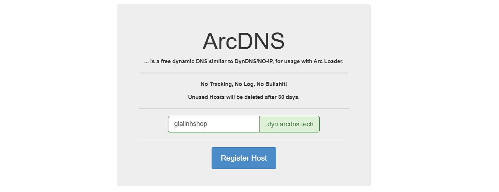

Synology DDNS Cloudflare or DDNS Arcdns.tech with multidomains and subdomains
========================

Description
---------------
* A PHP script for Synology DSM which adds Cloudflare DDNS support in your DMS
* Supports multidomains, subdomains and also regional domains (example: dev.my.domain.com.au, domain.com.uk etc)
* Easy instalation process
* Based on CloudFlare API v4

Before start to use this script
---------------
* Have a Cloudflare account with active domains
* Have A Records

Example
---------------
[Cloudflare](https://www.cloudflare.com/) ddns


---------------
[arcdns.tech](https://arcdns.tech/) ddns



Installation
----------------
1. Activate SSH in DMS (__Control Panel -> Terminal & SNMP -> Enable SSH service__)


2. Connect via SSH and execute command  install cloudflare.php & arcdns.php to /usr/syno/bin/ddns/

```
sudo -i

wget https://raw.githubusercontent.com/dienmaythinhgia/SynologyDDNSCloudflareMultidomain/master/cloudflare.php -O /usr/syno/bin/ddns/cloudflare.php && sudo chmod 755 /usr/syno/bin/ddns/cloudflare.php
wget https://raw.githubusercontent.com/dienmaythinhgia/SynologyDDNSCloudflareMultidomain/master/arcdns.php -O /usr/syno/bin/ddns/arcdns.php && sudo chmod 755 /usr/syno/bin/ddns/arcdns.php
```

3. Add Cloudflare and Arcdns to the list of DDNS providers DDNS file(Location : __/etc.defaults/ddns_provider.conf__)

```
wget https://raw.githubusercontent.com/dienmaythinhgia/SynologyDDNSCloudflareMultidomain/master/ddns_provider.conf -O /etc.defaults/ddns_provider.conf

hoac :
[Cloudflare]
  modulepath=/usr/syno/bin/ddns/cloudflare.php
  queryurl=https://www.cloudflare.com/
[ArcDNS.tech]
        modulepath=/usr/syno/bin/ddns/arcdns.php
        queryurl=https://arcdns.tech/update/__HOSTNAME__/__PASSWORD__
```

5. Than go to DMS settingS __Control Panel -> External Access -> DDNS__ and add new DDNS:

* Select Cloudflare as a service provider
* Set in __hostname__ field your list of domains divided by __---__ example: __mydoman.com---subdomain.mydomain.com---vpn.mydomain.com__ or simple: __mydomain.com__
* Set your Cloudflare acoount email into __Username/Email__ field
* Set Cloudflare Global API Key into __Password/Key__ field (See: [https://dash.cloudflare.com/profile/api-tokens](https://dash.cloudflare.com/profile/api-tokens))


6. Enjoy 🍺
